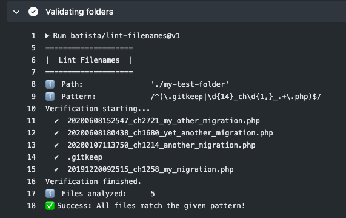

# Lint Filenames action

<p align="center">
  <a href="https://github.com/batista/lint-filenames/actions?query=workflow%3Abuild-test+branch%3Amaster"></a>
  <a href="https://github.com/batista/lint-filenames/actions?query=workflow%3ACodeQL+branch%3Amaster"></a>
  <a href="https://github.com/batista/lint-filenames/actions/workflows/codacy-analysis.yml"></a>
  <a href="https://github.com/batista/lint-filenames/blob/main/LICENSE"></a>
</p>

**Lint Filenames** is an simple github action to help you ensure certain patterns
are followed in a given folder in your repository.



## Inputs

### `path`

**Required** The path to a directory to check the filenames.

### `pattern`

**Required** The _escaped_ regex pattern to match for each of the files in the given directory.

- _NOTE:_ the pattern needs to have all backslashes (`\`) escaped, i.e. for each `\` you need
  to replace with `\\`.
- Example: `/^\d+\.jpg$/` should be `/^\\d+\\.jpg$/`.

_For more examples, see [`./__tests__/validate-filenames.test.ts`](./__tests__/validate-filenames.test.ts)._

## Outputs

### `total-files-analyzed`

The number of files analyzed.

## Example usage

to ensure all files match the pattern `/^.+\..+$/` in the `my-files` directory, use the following:

```yml
uses: batista/lint-filenames@v1
name: Validating my-folder filenames
with:
  path: './my-folder'
  pattern: '^.+\\..+$'
```

---

## Development

Install the dependencies

```bash
npm install
```

Build the typescript and package it for distribution

```bash
npm run build && npm run package
```

Run the tests :heavy_check_mark:

```bash
npm test

 PASS  __tests__/validate-filenames.test.ts
  Name of the group
    ✓ 01 - Passes for any character files (10 ms)
    ✓ 02 - Passes for `name.ext` files (1 ms)
    ✓ 03 - Passes for `.dotfiles` (1 ms)
    ✓ 04 - Passes for no `.dotfiles`
    ✓ 05 - Passes for files with `a` in the name (1 ms)
    ✓ 06 - Passes for json files `*.json` (1 ms)

Test Suites: 1 passed, 1 total
Tests:       6 passed, 6 total
Snapshots:   0 total
Time:        0.559 s, estimated 2 s
Ran all test suites.

```

## Publish to a distribution branch

Actions are run from GitHub repos so we will checkin the packed dist folder.

Then run [ncc](https://github.com/zeit/ncc) and push the results:

```bash
$ npm run package
$ git add dist
$ git commit -a -m "prod dependencies"
$ git push origin releases/v1
```

Your action is now published! :rocket:

See the [versioning documentation](https://github.com/actions/toolkit/blob/master/docs/action-versioning.md)

## Validate

You can now validate the action by referencing `./` in a workflow in your repo (see [test.yml](.github/workflows/test.yml))

```yaml
uses: ./
with:
  path: './__tests__/test-files/06-json-files'
  pattern: "\\.json$"
```

See the [actions tab](https://github.com/batista/lint-filenames/actions) for runs of this action! :rocket:

## Usage

After testing you can [create a v1 tag](https://github.com/actions/toolkit/blob/master/docs/action-versioning.md) to reference the stable and latest V1 action
